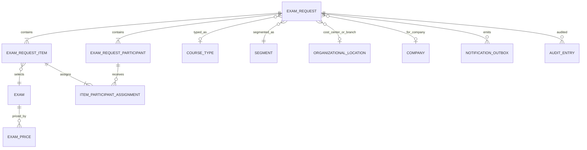

# Modelo de dominio revisado con respuestas

ExamRequest contiene participantes únicos y líneas `ExamRequestItem`. Cada línea selecciona un examen, conserva costo base/precio de venta/moneda/cantidad/total y asigna participantes mediante entidad de unión. Un participante puede aparecer en varias líneas; no hay voucher sin asignar. La equivalencia exacta `item.quantity = assignments` sigue supuesto P-16.

`OrganizationalLocation` representa “Centro de Costos o Sucursal”; sus códigos confirmados forman un catálogo sin jerarquía inventada. ExamPrice depende de país y proveedor. El Excel es fuente inicial, pero no contiene moneda, país ni vigencia.
