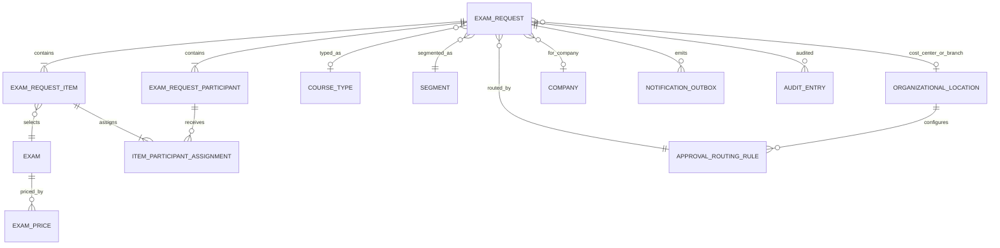

# Modelo de dominio revisado con respuestas

ExamRequest contiene participantes únicos y líneas `ExamRequestItem`. Cada línea selecciona un examen, conserva costo base/precio de venta/moneda/cantidad/total y asigna participantes mediante entidad de unión. Un participante puede aparecer en varias líneas; no hay voucher sin asignar. Regla confirmada: `item.quantity = count(assignments)`.

`OrganizationalLocation` representa “Centro de Costos o Sucursal”; sus códigos confirmados forman un catálogo sin jerarquía inventada. ExamPrice depende de país y proveedor. El Excel es fuente inicial, pero no contiene moneda, país ni vigencia.

`ApprovalRoutingRule` relaciona una sede con un destinatario durante una vigencia. El backend la resuelve en submit y `ExamRequest` congela sede, nombre/correo del destinatario y ruleId. BOG/MED/SCL/LIM→Felipe González, WTC→Angélica Barrón y MAD→Paola Galvis son registros iniciales con correos confirmados, nunca ramas de código. El rol/área confirmado es Finanzas y pertenecen a Facturación. `Approver` separado queda PROPUESTO para suplentes o multiplicidad, pendientes P-33/P-34.
## Extensión aprobada: catálogo y asignaciones

`ExamRequest 1─* ExamRequestParticipant 1─* ParticipantExamAssignment *─1 ExamCatalogItem`.

`ParticipantExamAssignment` incluye `examRequestId` para reforzar frontera del agregado, además de `participantId`, `examCatalogId` y snapshots financieros/visuales. `ExamCatalogItem` contiene proveedor, curso, código, nombre, retake, costo base USD, comentarios, activo y trazabilidad de importación. La cantidad no es estado mutable: se deriva agrupando asignaciones por examen.
## Empresa durante MVP

`ExamRequest.companyNameSnapshot` es texto nullable durante BORRADOR y obligatorio en una futura transición de envío. `companyId`, si se incorpora después, no reemplaza ni reescribe el snapshot histórico. ADR-042 gobierna la evolución.

## Identidad comercial

`ExamRequest` mantiene requester y salesAdvisor como conceptos semánticos distintos. En el MVP, `salesAdvisorUserId`, `salesAdvisorNameSnapshot` y `salesAdvisorUpnSnapshot` se copian exclusivamente desde la misma identidad autenticada que requester. No existe agregado ni catálogo `SalesAdvisor` activo; delegación es evolución futura gobernada por ADR-044.
