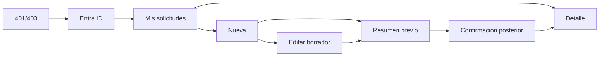

# Navegación

Guard exige autenticación y EXAM_SALES. El resumen previo es modal/ruta interna no direccionable y no muta. Rutas restantes se conservan. Edit solo para BORRADOR propio; enviado bloquea campos comerciales, examen, participantes e importes.
