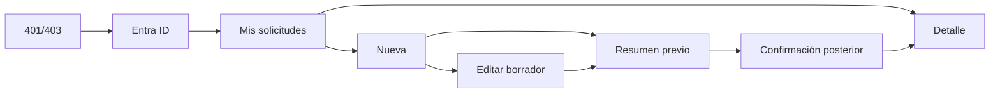

# Navegación

Guard exige autenticación y EXAM_SALES. El resumen previo es modal/ruta interna no direccionable y no muta. Rutas restantes se conservan. Edit solo para BORRADOR propio; enviado bloquea campos comerciales, examen, participantes e importes.
# Extensión: enrutamiento de aprobación

Nueva/Editar conserva el flujo Sede → resolución → tarjeta de aprobador → resumen → confirmación. La ausencia de regla no expulsa del formulario ni impide Guardar. Enviar lleva a confirmación solo con resolución vigente; un 409 `APPROVAL_ROUTE_CHANGED` devuelve al resumen, enfoca la tarjeta y exige confirmar otra vez.

## Navegación autenticada propuesta

`/acceso` ofrece login Microsoft por redirect; no popup. “Acceso externo” no tiene ruta. Tras callback se restaura sesión antes de rutas. Nueva muestra Solicitante fijo y pasos 1 Comercial → 2 Participantes → 3 Exámenes → 4 Resumen. Futuros quedan bloqueados; visitados permiten volver libremente. El borrador restaura el último paso guardado. Tras logout MSAL, URL/historial vuelve a Acceso.
## Navegación de sesión

Tab alcanza el activador; Enter/Space abre; flechas recorren items; Escape o clic exterior cierra; Material restaura foco al activador. Logout emite evento al contenedor y respeta confirmación de formulario sucio.
