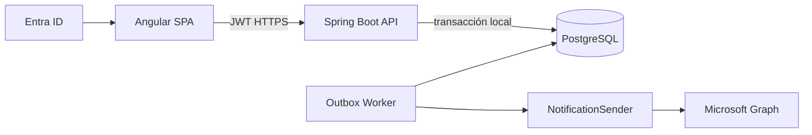

# Arquitectura

## Actualización por evidencia real

El agregado contiene participantes, líneas y asignaciones N:M. Catálogo resuelve costo USD; para MAD un servicio de tipo de cambio backend resuelve USD→EUR vigente. Ventas captura precio venta en moneda destino; se congelan origen, tasa y resultado. Otras ubicaciones no invocan conversión.

Monorepo: contratos en `specs`, futuros `frontend`, `backend`, `database`, `docker`, `tests`. Backend por capas/hexagonal: web, aplicación, dominio, persistencia y adaptadores. La API no espera correo. En local, Compose levantará PostgreSQL, API, SPA y adaptador simulado explícito. Configuración por perfiles/variables; secretos fuera de Git. OpenAPI es contrato revisable, Flyway gobierna esquema.

Observabilidad: JSON con timestamp, nivel, service, correlationId (aceptado/creado), requestId único, userId pseudónimo, folio cuando exista; nunca token, cuerpo completo ni email. Métricas: creadas, duplicados bloqueados, notificaciones SENT/FAILED/DEAD_LETTER, latencia API/worker y profundidad/edad de outbox. Actuator separado: liveness solo proceso; readiness DB/configuración esencial (no Graph). Alertas por DEAD_LETTER, edad de outbox y tasa de error.

## Enrutamiento de aprobación

El módulo consulta `ApprovalRoutingRule` por sede, actividad y vigencia. La resolución UI es informativa; submit la repite en backend y crea snapshots+outbox. No existe destinatario codificado ni aceptado del frontend. Testing Center no reenvía. Aprobación y compra continúan fuera del portal.

## Configuración frontend y same-origin — IN_REVIEW

Navegador → NGINX frontend → Angular estático → `/api/...` → NGINX reverse proxy conservando `/api` → Spring Boot. La imagen Angular es única; NGINX resuelve backend por variables y genera configuración pública runtime. Angular no lee `.env`; Spring usa variables privadas; NGINX no sustituye autenticación. ADR-028..031 documentan la decisión propuesta.
